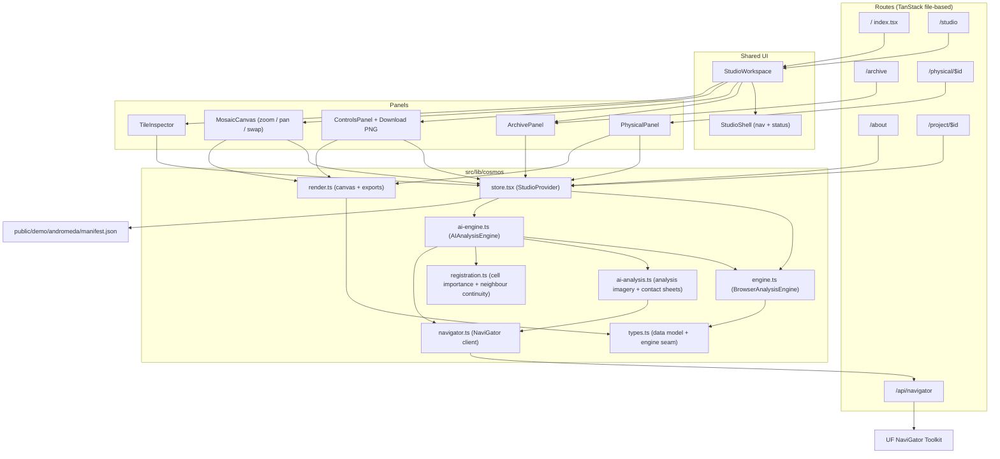
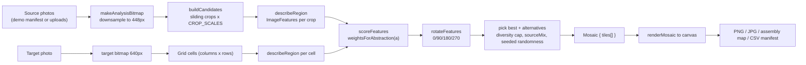
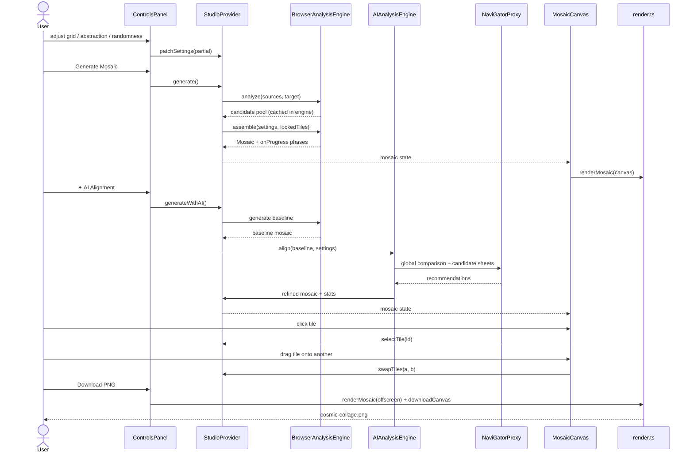
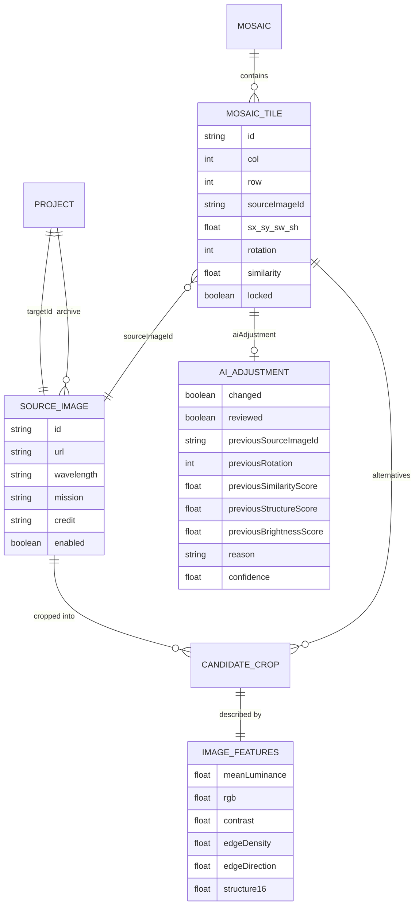
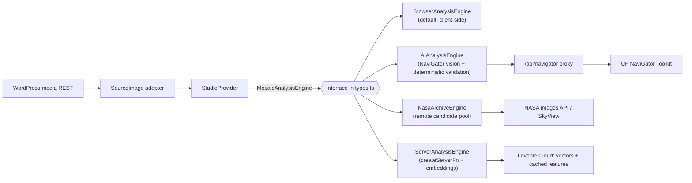

# Cosmic Collage

<p align="center">
  
  <br />
  <em>Studio — reconstructing Andromeda from fragments of real NASA observations</em>
</p>

<p align="center">
  
  <br />
  <em>Physical Assembly Map — tile labels, source provenance, and print-ready exports</em>
</p>

Cosmic Collage is a browser-based *computational instrument* for reconstructing an
astronomical image out of fragments of other **real** astronomical photographs.

The pipeline is:

```text
Photo Archive → Image Analysis → Target → Grid → Reconstruction
             → Abstraction → Manual Refinement → Physical Collage Export
```

Hard rule of the product: **no synthetic imagery is ever painted into a collage.**
Every visible pixel of a tile is a crop of an actual source photograph, and every
tile keeps a full provenance record (source photo, crop rect, rotation, scale,
match scores).

The first-run experience is a working demo: five real NASA Andromeda
observations (GALEX UV, WISE IR, Spitzer IR, a UV+IR composite) are preloaded, no
login required.

---

## 0. Diagrams

### 0.1 System structure



### 0.2 Generation pipeline



### 0.3 AI Alignment pipeline

```mermaid
flowchart LR
  T["Target image"] -->|"renderTargetAnalysisImage"| TI["reduced-resolution JPEG"]
  S["Source archive"] -->|"BrowserAnalysisEngine"| B["Baseline mosaic"]
  B -->|"renderMosaicAnalysisImage"| MI["reduced-resolution JPEG"]
  TI -->|"analyzeGlobalAlignment"| G["Global structural comparison"]
  MI --> G
  G -->|"regionWeightFactory"| RW["Region weights"]
  T -->|"targetCellImportance"| CI["Cell importance map"]
  B -->|"neighborDisagreement"| ND["Neighbour continuity"]
  CI --> RANK["rankWeakTiles"]
  ND --> RANK
  RW --> RANK
  RANK --> WEAK["Weak tile list"]
  WEAK -->|"buildContactSheet"| CS["Contact sheets<br/>A..H candidates"]
  CS -->|"chooseCandidate"| NAV["NaviGator vision model"]
  NAV --> REC["Recommended swaps/rotations"]
  REC -->|"scoreFeatures"| VAL["Numerical validation"]
  VAL --> FINAL["Final AI-aligned mosaic"]
  FINAL -->|"aiAdjustment provenance"| EXP["Export / inspector"]
```



### 0.4 Interaction sequence (generate + refine + export)



### 0.5 Data model relationships



### 0.6 Extension seam for remote / AI matching



---

## 1. Stack

| Concern | Choice |
| --- | --- |
| Framework | TanStack Start v1 (React 19, SSR-capable) |
| Build | Vite 7 |
| Router | TanStack Router, file-based (`src/routes/`) |
| Styling | Tailwind CSS v4 via `src/styles.css` (OKLCH semantic tokens) |
| UI kit | shadcn/ui + Radix primitives (`src/components/ui/`) |
| Data fetching | TanStack Query (available; the demo loads a static manifest) |
| Compute | 100% client-side Canvas 2D + typed arrays. No backend today. |

There is deliberately **no database and no auth** yet. All state lives in one
React context provider for the session.

---

## 2. Directory map

```text
src/
  routes/
    __root.tsx            root layout: fonts, dark class, <StudioProvider>
    index.tsx             "/" — loads the studio with the Andromeda demo directly
    studio.tsx            "/studio" — same <StudioWorkspace />, canonical editor URL
    about.tsx             "/about" — the narrative landing page / upload entry point
    archive.tsx           full-library browser
    project.$id.tsx       project metadata + mosaic statistics
    physical.$id.tsx      assembly blueprint + export tools
  components/cosmos/
    StudioWorkspace.tsx   three-column editor layout shared by / and /studio
    StudioShell.tsx       persistent chrome: nav, status, progress
    ArchivePanel.tsx      source list, wavelength filters, personal uploads
    ControlsPanel.tsx     grid, abstraction, randomness, diversity, presets
    MosaicCanvas.tsx      viewport: zoom/pan, tile picking, drag-to-swap
    TileInspector.tsx     provenance + alternative candidates + lock/rotate
    PhysicalPanel.tsx     assembly map, PNG/CSV export
  lib/cosmos/
    types.ts              the data model + the engine interface
    engine.ts             BrowserAnalysisEngine (analysis + matching)
    render.ts             canvas compositing, assembly map, exports
    store.tsx             StudioProvider: all app state and actions
    navigator.ts          UF NaviGator Toolkit client (OpenAI-compatible)
    ai-engine.ts          AIAnalysisEngine: 5-phase alignment pipeline
    ai-analysis.ts        analysis imagery + candidate contact sheets
    registration.ts       cell importance + neighbour continuity maths
  routes/api/
    navigator.$.ts        same-origin proxy for NaviGator API (CORS)
public/demo/index.json                built-in demo registry (andromeda, orion)
public/demo/andromeda/manifest.json   demo project definition
public/demo/orion/manifest.json       Orion Nebula demo (+ SOURCES.md provenance)
```

---

## 3. Data model (`src/lib/cosmos/types.ts`)

Read this file first; it is the contract every other module obeys.

- **`SourceImage`** — one photograph in the archive. Carries `url`, `wavelength`,
  `nasaId`, `mission`, `credit`, `photographer`, `equipment`, `tags`, `enabled`,
  `origin: "demo" | "upload"`, natural `width`/`height`. Provenance fields are
  never dropped; the inspector and CSV export read them directly.
- **`ImageFeatures`** — the visual descriptor of a region: mean `r,g,b`, `h,s,v`,
  `luminance`, `contrast`, a 12-bin `histogram` (4 luminance × 3
  channel-dominance bins), `edgeDensity`, `edgeDirection` (radians, 0..π), and a
  4×4 `structure` grid of luminance.
- **`CandidateCrop`** — a normalised crop rect (`x,y,w,h` in 0..1) inside one
  source photograph, plus its `features` and a stable `index` into the engine's
  candidate pool.
- **`MosaicTile`** — one grid cell: `row`, `column`, `sourceImageId`,
  `candidateIndex`, the crop rect, `rotation` (0/90/180/270), `scale`, the four
  score components, `locked`, `alternatives` (candidate indexes offered in the
  inspector), and optionally `aiAdjustment` — provenance of any AI-suggested
  replacement (previous candidate/rotation/scores, reason, confidence).
- **`AiAdjustment`** — tracks whether AI Alignment reviewed or changed a tile.
  Never replaces photographic credit; it only records the model's recommendation
  and the application's validation decision.
- **`MosaicSettings`** — `columns`, `rows`, `tileGap`, `tileBorder`,
  `aspectMode`, `abstraction`, `randomness`, `seed`/`seedLocked`, `diversity`,
  `maxTilesPerSource`, `allowRotation`, `sourceMix` (per-wavelength weighting),
  `includeTargetInSources`.
- **`Mosaic`** — settings snapshot + `targetId` + `tiles` + `candidateCount` +
  `createdAt` + `engine: "visual" | "ai"` (records which engine produced it).
- **`MosaicAnalysisEngine`** — **the extension seam.** Any implementation of
  `analyzeImage`, `findCandidates`, `generateMosaic` can be dropped in, including
  a remote AI service. `Mosaic.engine` records which one produced a result.

Grid labels are human-readable via `tileLabel(row, column)` → `A01`, `B07`, …
used in the assembly map and CSV.

---

## 4. The engine (`src/lib/cosmos/engine.ts`)

Entirely client-side, deterministic given a seed (`mulberry32`).

1. **Bitmap reduction** — `makeAnalysisBitmap(img, maxSize)` draws the photo into
   an offscreen canvas (sources at 448px, target at 640px) and keeps the raw
   `Uint8ClampedArray`. All later math runs on these small buffers, never on
   full-resolution pixels.
2. **Description** — `describeRegion(bmp, nx, ny, nw, nh)` samples an 8×8 lattice
   over a normalised rect and produces one `ImageFeatures`.
3. **Candidate generation** — `buildCandidates()` slides windows over each source
   at `CROP_SCALES = [1.0, 1.5, 2.0]` with 25% overlap, then decimates evenly to
   at most `MAX_CANDIDATES_PER_SOURCE = 260` per photograph.
4. **Rotation** — `rotateFeatures()` rotates the 4×4 structure grid and the edge
   direction, so all four orientations are scored without re-sampling pixels.
5. **Scoring** — `scoreFeatures(target, candidate, weights)` returns brightness,
   colour, structure, contrast, edge-density and edge-direction terms combined
   into `similarity`. `weightsForAbstraction(a)` re-balances those weights: low
   abstraction favours structure/edges (photographic fidelity), high abstraction
   favours colour/brightness (painterly).
6. **Assembly** — for each grid cell the engine describes the target region,
   samples a candidate subset (bounded for large grids), applies `sourceMix`
   bonuses and a `maxTilesPerSource` usage cap for diversity, injects
   `randomness` (amplified by high abstraction), respects locked tiles passed in
   via `ctx.lockedTiles`, and emits a `MosaicTile` with its top `alternatives`.
   `onProgress` reports phases; `yieldToUI()` keeps the main thread responsive.

`browserEngine` is the shared singleton instance; it keeps the last candidate
pool in memory so the Tile Inspector can rank alternatives instantly.

---

## 5. Rendering and export (`src/lib/cosmos/render.ts`)

- `preloadImages()` warms the image cache.
- `renderMosaic(mosaic, sources, opts)` composites tiles onto a canvas
  (rotation, gap, border aware). Total width is capped around 3600px for browser
  stability.
- `renderAssemblyMap()` draws the numbered physical-assembly blueprint.
- `renderCandidatePreview()` renders a single crop for inspector thumbnails.
- `tileManifestCsv(mosaic, sources)` emits one row per tile with label, source
  name, credit, crop rect, rotation and scores — the print/cut-list artefact.
- `downloadCanvas()` / `downloadText()` trigger the browser downloads.

---

## 6. AI Alignment (`src/lib/cosmos/ai-engine.ts`)

AI Alignment is an optional refinement pass that uses the UF NaviGator Toolkit
(`https://api.ai.it.ufl.edu/v1`) as an **artistic curator**, not a generator.
Every pixel in the final collage still comes from the existing real source
photographs; the AI only selects, rotates, and arranges fragments that are
already in the archive. The implementation is a second `MosaicAnalysisEngine`
with `mode: "ai"` so the rest of the UI (inspector, assembly map, CSV) works
unchanged.

### 6.1 Design principles

- **The AI is an advisor; the application has the final say.** All model
  recommendations are numerically re-validated with the deterministic
  `scoreFeatures` function before they are accepted.
- **No synthetic imagery.** The vision model only ever receives reduced-resolution
  copies of existing photographs and chooses between real crops. It cannot paint,
  blend, inpaint, or hallucinate pixels.
- **Provenance is preserved.** Every accepted change writes an `AiAdjustment`
  record into the tile, including the previous source, rotation, scores, the
  model's reason, and its confidence. Rejected changes still record
  `reviewed: true`.
- **Privacy by default.** The NaviGator API key is stored only in the browser's
  `localStorage`; it is never written into mosaics, gallery entries, exported
  PNGs, CSV manifests, URLs, logs, or error messages.
- **CORS proxy.** Because the NaviGator API does not send CORS headers, a
  same-origin TanStack server route (`src/routes/api/navigator.$.ts`) forwards
  requests to the upstream. The browser sees `/api/navigator/*`; the key still
  travels in the `Authorization` header, and the proxy never logs it.

### 6.2 The five-phase pipeline

`AIAnalysisEngine.align()` runs these phases in order:

1. **Baseline generation** — produces a deterministic mosaic with the
   `BrowserAnalysisEngine` using the current settings and locked tiles. This is
   always the starting point, so the user never loses the non-AI result.
2. **Global structural comparison** — `renderTargetAnalysisImage()` and
   `renderMosaicAnalysisImage()` create reduced-resolution JPEGs (≤1280px) and
   send them to `analyzeGlobalAlignment()`. NaviGator returns overall scores for
   structure, brightness, orientation, and visual coherence, plus up to 24
   regions where a different tile could help.
3. **Weak-region detection** — deterministic maths ranks the worst tiles:
   - `targetCellImportance()` measures contrast, edge density, and luminance of
     each target cell.
   - `neighborDisagreement()` measures how much a tile's brightness breaks local
     continuity compared with the target.
   - `rankWeakTiles()` ranks tiles by `1 - alignmentQuality(tile)` scaled by the
     cell importance map and any AI-flagged region weight — the same objective
     function used for acceptance and reporting.
   - Up to ~12% of tiles (bounded by `MIN_REVIEW_TILES` and `MAX_REVIEW_TILES`)
     are queued for review; locked tiles are skipped.
4. **Candidate contact sheets** — for each weak tile, `buildContactSheet()` draws
   a 4×4 grid: the target cell with surroundings, the current tile, and up to eight
   alternative crops from the candidate pool labelled A..H. `chooseCandidate()`
   sends the sheet to NaviGator and asks it to pick the best real fragment, or
   return `"CURRENT"`. Concurrency is capped at 2 requests with exponential
   backoff on transient errors.

   The prompt makes "no change" a first-class answer: the model is told the current
   fragment was chosen by a numerical matcher, may already be optimal, and that a
   large share of regions need no change. It must also report
   `differenceFromCurrent` (`none` | `minor` | `clear` | `strong`) plus the
   `targetFeatures` it actually read. Only `clear` and `strong` recommendations
   reach validation; `none`/`minor` are counted and discarded. Self-reported
   `confidence` is displayed but never used as a quality measure.
5. **Numerical validation and application** — the engine evaluates the chosen
   photograph at every permitted rotation (the model never chooses rotation) and
   keeps the rotation with the highest composite quality. A change is applied only
   when the composite delta clears `MIN_REFINEMENT_DELTA` (0.012):

   ```ts
   alignmentQuality(tile) =
     structureScore  * 0.45 +
     similarityScore * 0.35 +
     brightnessScore * 0.15 +
     continuityScore * 0.05;
   ```

   `src/lib/cosmos/quality.ts` owns this formula and it is the only acceptance
   criterion — a structural gain can no longer buy a brightness or similarity loss
   the way the old `structureImproved || similarityImproved` rule allowed. The same
   number is reported as "Alignment quality" for the whole mosaic and for AI-changed
   tiles, so the accepted metric and the displayed metric are identical.

   Each run also computes an internal control: the same weak regions refined by
   randomly chosen valid alternatives under identical validation. Its changed count,
   structure delta and composite delta appear under **AI Diagnostics**, so NaviGator's
   contribution can be compared against non-AI selection.

### 6.3 Files and responsibilities

| File | Responsibility |
| --- | --- |
| `src/lib/cosmos/navigator.ts` | API key/model storage in `localStorage`, model discovery (`listModels`, `resolveModel`), `visionJson()` multimodal requests, `runQueue()` with retries/backoff, typed `NavigatorError` kinds. |
| `src/lib/cosmos/ai-engine.ts` | `AIAnalysisEngine` implementing `MosaicAnalysisEngine`; orchestrates the 5-phase pipeline; emits `AiProgress` and `AiAlignmentStats`. |
| `src/lib/cosmos/ai-analysis.ts` | `renderTargetAnalysisImage()`, `renderMosaicAnalysisImage()`, `buildContactSheet()`, `analyzeGlobalAlignment()`, `chooseCandidate()`; Zod schemas for structured JSON responses. |
| `src/lib/cosmos/quality.ts` | `alignmentQuality()`, `averageQuality()`, `continuityFor()`, `buildContinuity()`, `MIN_REFINEMENT_DELTA` — the single alignment objective shared by ranking, validation and reporting. |
| `src/lib/cosmos/registration.ts` | `targetCellImportance()`, `neighborDisagreement()`, `rankWeakTiles()` — pure deterministic maths with no network calls. |
| `src/routes/api/navigator.$.ts` | Same-origin proxy to `https://api.ai.it.ufl.edu/v1`; forwards method, body, and `Authorization` header; required because the upstream lacks CORS. |

### 6.4 UI wiring

- **ControlsPanel** shows a "✦ AI Alignment" button and a settings gear. The
  settings dialog accepts a NaviGator key, selects a model (or "auto"), and tests
  the connection through the proxy. A consent dialog is shown before the first
  run because reduced-resolution images are sent to a third-party model.
- **StudioProvider** adds `aiGenerating`, `aiProgress`, `aiBaseline`, `aiStats`,
  `aiError`, and `navigatorConnected` to its state. `generateWithAI()` calls
  `aiEngine.align()` and stores the refined mosaic; `cancelAIGeneration()` aborts
  via `AbortController`.
- **MosaicCanvas** adds a "baseline" view so the user can compare the
  pre-AI reconstruction side-by-side with the refined result, and a
  `showAiChanges` overlay that highlights tiles modified by AI Alignment.
- **TileInspector** displays the `AiAdjustment` provenance: whether the tile was
  reviewed, changed, the previous source/rotation, the model's reason, and its
  confidence.

### 6.5 Extending the AI engine

- **Swap the vision model** — change `PREFERRED_MODELS` in `navigator.ts`. The
  client auto-detects vision-capable models from the NaviGator `/models` endpoint.
- **Change what is sent for review** — edit `rankWeakTiles()` in
  `registration.ts` to add other local metrics (e.g., colour mismatch, edge
  direction disagreement).
- **Change the prompt** — `GLOBAL_PROMPT` and `SHEET_PROMPT` in `ai-analysis.ts`
  are plain strings. Keep the instruction that the model must not generate or
  modify pixels, and keep the Zod schemas in sync with the expected JSON shape.
- **Add a different AI backend** — implement the same `MosaicAnalysisEngine`
  interface in a new engine file and register it in `store.tsx` alongside
  `browserEngine` and `aiEngine`. The UI and export paths do not need to change.

---

## 7. State (`src/lib/cosmos/store.tsx`)

`StudioProvider` is mounted once in `__root.tsx` and exposes `useStudio()`:

- Data: `project`, `images`, `target`, `sourcePool`, `settings`, `mosaic`,
  `ready`, `generating`, `progress`, `selectedTileId`, `engineMode`, plus
  AI Alignment state: `aiGenerating`, `aiProgress`, `aiBaseline`, `aiStats`,
  `aiError`, `navigatorConnected`.
- Actions: `openDemo`, `patchSettings`, `setTarget`, `toggleImage`,
  `updateImage`, `removeImage`, `addUploads`, `generate`, `newSeed`,
  `selectTile`, `imageById`, `suggest`, `replaceTile`, `swapTiles`,
  `rotateTile`, `toggleLock`, `generateWithAI`, `cancelAIGeneration`.

`openDemo(slug = "andromeda")` fetches `/demo/<slug>/manifest.json`, maps each
entry to a `SourceImage`, picks the `type: "target"` entry as the target, resets
the current mosaic, and creates the `Project` with id `<slug>-demo`. The active
slug is exposed as `activeDemo`. Built-in demos are enumerated in
`public/demo/index.json` (`slug`, `name`, `object`, `description`, `manifest`,
`thumbnail`, `imageCount`); the Gallery renders one card per entry and calls
`openDemo(slug)`. Adding a demo = drop a manifest under `public/demo/<slug>/`
and add a row to that index. Shipped demos: `andromeda` (5 GALEX/WISE/Spitzer
observations) and `orion` (6 Hubble/Spitzer/WISE/Herschel/JWST observations).
`addUploads()` does the same for local `File` objects via object URLs.

Manifest entry shape:

```json
{
  "id": "pia12832",
  "nasaId": "PIA12832",
  "file": "PIA12832_WISE_IR.jpg",
  "url": "https://…/PIA12832_WISE_IR.jpg",
  "title": "The Infrared Face of the Andromeda Galaxy",
  "mission": "WISE",
  "wavelength": "ir",
  "type": "source",
  "tags": ["galaxy", "infrared"],
  "credit": "NASA/JPL-Caltech/UCLA"
}
```

`wavelength` is normalised into the `Wavelength` union; unknown values fall back
to `"other"`.

---

## 8. Canvas interactions (`MosaicCanvas.tsx`)

A single `camera` state `{ zoom, x, y }` drives one CSS transform with
`transform-origin: center center` on an `absolute inset-0 flex items-center
justify-center` layer.

- **Wheel** — cursor-anchored zoom. Cursor coordinates are taken *relative to the
  viewport centre* (`e.clientX - rect.left - rect.width / 2`) so the anchor math
  matches the transform origin. Zoom and offset are committed in one state update
  — splitting them applies the offset twice.
- **Magnifier buttons** — zoom in/out/reset anchored at the viewport centre.
- **Right-drag** — pan.
- **Left-drag a tile onto another** — `swapTiles()` exchanges the two tiles'
  visual payload and provenance while keeping their ids and grid coordinates.
- **Left-click** — `selectTile()`, which drives the Tile Inspector.

Views: Reconstruction, Target, and Split-Compare.

---

## 9. Adding features — where to plug in

### 9a. A new image source (NASA APIs, a WordPress media library, S3, …)

Everything downstream only knows about `SourceImage[]`, so an integration is an
*adapter* that produces those objects. Recommended shape:

1. Add `src/lib/cosmos/sources/<provider>.ts` exporting
   `async function fetchFrom<Provider>(query): Promise<SourceImage[]>`.
   Map provider metadata onto the provenance fields (`credit`, `mission`,
   `photographer`, `equipment`, `captureDate`, `tags`) — never discard it.
2. Fetch from the server, not the browser, when a key or CORS is involved: add a
   `createServerFn` in e.g. `src/lib/cosmos/sources.functions.ts` and read secrets
   with `process.env[...]` **inside** `.handler()`. Public/webhook endpoints go
   under `src/routes/api/public/*`.
3. Add an `importImages(images: SourceImage[])` action to `StudioProvider`
   alongside `addUploads`, and a picker UI in `ArchivePanel`.
4. CORS matters: the engine reads pixels with `getImageData`, so remote images
   must be served with permissive CORS (`loadImage` sets `crossOrigin`) or be
   proxied through a server route.

Concrete targets:
- **NASA Images API** (`images-api.nasa.gov/search?q=`) — returns `nasa_id`,
  `title`, `description`, `keywords`, `center`; asset URLs come from
  `/asset/{nasa_id}`. Use the `~orig`/large JPEG, map `keywords` → `tags`.
- **NASA APOD / SkyView / MAST** — same adapter contract; MAST/FITS would need a
  conversion step to RGB before it can enter the archive.
- **WordPress** — `GET /wp-json/wp/v2/media?per_page=100` gives
  `source_url`, `media_details.sizes`, `title.rendered`, `caption`, `alt_text`,
  and EXIF in `media_details.image_meta` (camera, aperture, created timestamp) —
  a good match for `equipment`, `captureDate`, `photographer`. Prefer a large
  registered size over the original for analysis speed.

### 9b. Persistence, accounts, sharing

Enable Lovable Cloud and store `Project`, `SourceImage` rows and serialised
`Mosaic` documents. `MosaicSettings` + `seed` + `targetId` fully reproduce a
collage, so a saved project can be tiny: settings, seed, source ids, plus any
manually edited/locked tiles. Roles must live in a separate `user_roles` table.

### 9c. A smarter matcher (the "AI" engine)

Implement `MosaicAnalysisEngine` with `mode: "ai"` (e.g. CLIP/DINO embeddings
computed server-side, cosine similarity + Hungarian assignment) and swap it in
where `browserEngine` is used in `store.tsx`. Keep the same `MosaicTile` output
so the inspector, assembly map and CSV keep working unchanged. Precomputed
embeddings per `SourceImage` are the natural thing to cache in the database.

### 9d. Performance headroom

Move `describeRegion` / candidate scoring into a Web Worker (or WASM) — the code
is already pure functions over typed arrays. `OffscreenCanvas` would let both
analysis and rendering run off the main thread and remove the current
`yieldToUI()` cooperative pauses.

---

## 10. Conventions to keep

- Colours, gradients and shadows come from the semantic tokens in
  `src/styles.css`. Never hardcode `text-white` / `bg-[#…]`.
- Fonts: Space Grotesk (display) + IBM Plex Mono (data), loaded via `<link>` in
  `__root.tsx` — not `@import` in CSS.
- Every route defines its own `head()` with a unique title/description.
- `createFileRoute("…")` strings must match the filename under
  `src/routes/`; `src/routeTree.gen.ts` is generated — never edit it.
- Never invent astronomical content. If a feature cannot cite a real source
  photograph for a pixel, it does not belong in the collage.

---

## 11. Local development

```sh
npm i
npm run dev     # http://localhost:8080
npm run build
npm run lint
```
